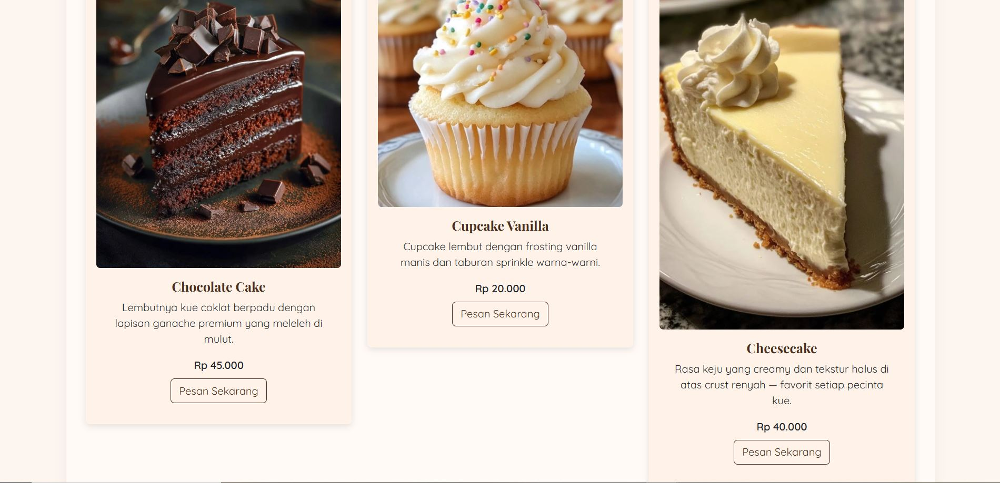
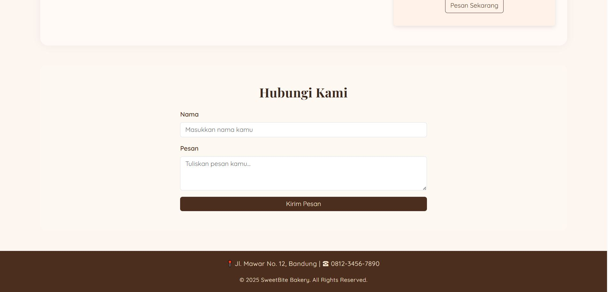

# 🍰 SweetBite Bakery

Website sederhana satu halaman bertema toko kue rumahan.  
Tugas implementasi **Layout CSS & Bootstrap 5**.

---

## 🧁 Deskripsi
SweetBite Bakery adalah website sederhana yang menampilkan tampilan toko kue dengan desain estetik bernuansa coklat dan krem.  
Halaman ini terdiri dari navbar, hero section, daftar produk, form kontak, dan footer.

---

## 🌸 Struktur Halaman
- **Navbar** — menu navigasi (Home, Produk, Kontak)  
- **Hero Section** — gambar latar & teks utama  
- **Produk Section** — menampilkan 3 kue dengan deskripsi dan tombol “Pesan Sekarang”  
- **Kontak Section** — form kirim pesan  
- **Footer** — alamat & hak cipta  

---

## 🎨 Teknologi yang Digunakan
- **HTML5**
- **CSS3 (Custom & Bootstrap 5.3)**
- **Google Fonts (Playfair Display & Quicksand)**
- **Gambar dari Unsplash & Pinterest**

---

## 📸 Tampilan Website

### Tampilan Awal

### Daftar Produk

### Form Kontak

---

## 🔗 Link Website
👉 [Klik di sini untuk melihat hasilnya](https://nazwaKhoerunnisa.github.io/SweetBite-Bakery/)
